<div align="center">


<h1>Clawd View</h1>

<p><b>A calm, plain-English view of Claude Code.</b><br/>
A checklist of every step, your usage at a glance, and Clawd acting out the work.</p>

<p>


<a href="https://github.com/thedepegger/clawd-view/stargazers"></a>
</p>

<p>
<a href="#install"></a>
<a href="#see-it-in-action"></a>
<a href="#all-commands"></a>
<a href="#privacy-and-cost"></a>
</p>

</div>

<br/>

<div align="center">
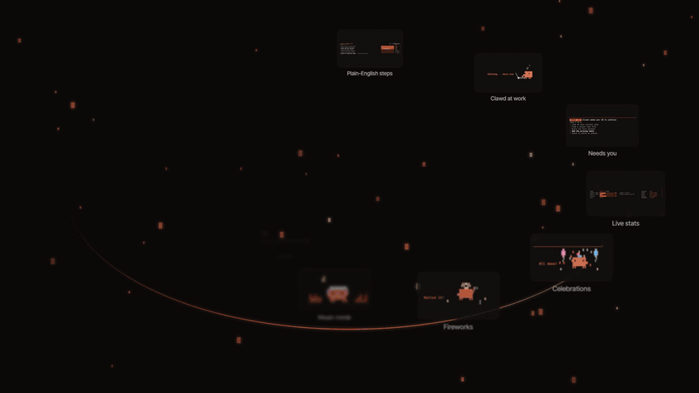
</div>

<br/>

> **Tool calls and commands stay out of sight, so the conversation reads like a conversation.**
> Made for people who want to know what Claude is doing, without the technical details.

## At a glance

<table>
<tr>
<td width="33%" valign="top" align="center">
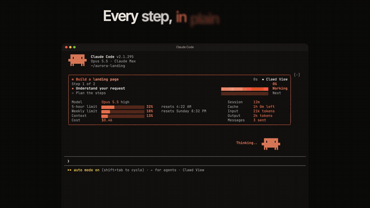<br/>
<b>A checklist of every step</b><br/>
<sub>Plain words, a progress bar for each step, and a news line for helpers</sub>
</td>
<td width="33%" valign="top" align="center">
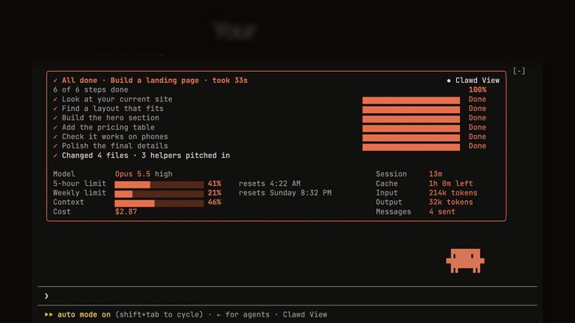<br/>
<b>Your usage, live</b><br/>
<sub>Model, 5-hour and weekly limits, context, cost, session, cache, tokens</sub>
</td>
<td width="33%" valign="top" align="center">
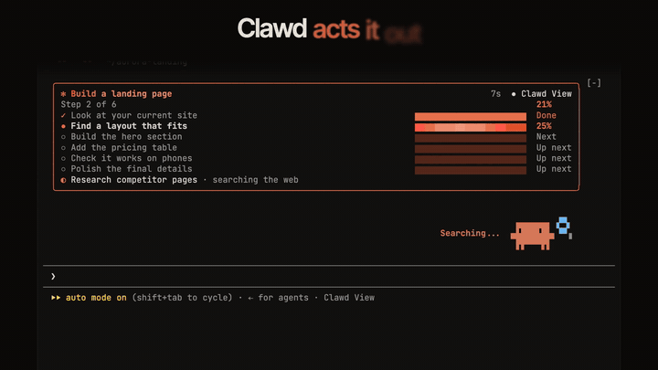<br/>
<b>Clawd acts it out</b><br/>
<sub>Reading, editing, running, searching, then a party when it's done</sub>
</td>
</tr>
</table>

## Install

> **ℹ️ Note**
>
> You need **Claude Code 2.1.287 or later** (with mods support). Works on macOS, Linux and Windows, in the terminal and in the desktop app's Code tab. Music mode is Mac-only (macOS 14.2+).

In Claude Code, in one step (answer `y`, then pick a scope):

```
/plugin install clawd-view --marketplace thedepegger/clawd-view
```

<div align="center">
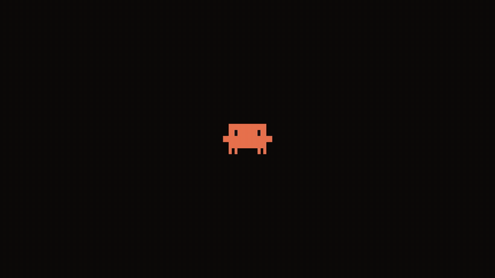
</div>

<details>
<summary><b>Other ways to install, update or remove</b></summary>

<br/>

In two steps:

```
/plugin marketplace add thedepegger/clawd-view
/plugin install clawd-view@clawd-view
```

From your shell:

```bash
claude plugin marketplace add thedepegger/clawd-view
claude plugin install clawd-view@clawd-view
```

**Update:**

```bash
claude plugin marketplace update clawd-view && claude plugin update clawd-view@clawd-view
```

**Remove:**

```bash
claude plugin uninstall clawd-view@clawd-view && claude plugin marketplace remove clawd-view
```

</details>

- Clawd View appears in your next session, or right away after `/reload-plugins`. The first time it runs it shows one short tip about the best window size.
- If the installer says "3 userConfig options not yet set", you can ignore it: every setting has a working default (see [Settings](#settings)).
- In `claude -p` runs and the SDK, nobody is watching the screen, so Clawd View stays out of the way.
- **Desktop app:** quit it fully (Cmd + Q) and open it again after installing or updating.

## See it in action

<table>
<tr>
<td width="50%" valign="top">

<h3>Every step, in plain English</h3>
Ask for anything and a checklist appears above the prompt: <b>Done</b>, <b>Working</b>, <b>Next</b>. <a href="#the-checklist-box">How it works →</a>
</td>
<td width="50%" valign="top">

<h3>Clawd acts it out</h3>
He reads, searches, types on a tiny laptop and runs, with the file name beside him. <a href="#clawd">All poses →</a>
</td>
</tr>
<tr>
<td width="50%" valign="top">
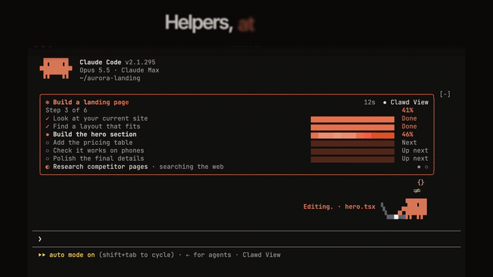
<h3>Helpers, at a glance</h3>
When Claude sends helpers out, one quiet line under the steps says what they're doing and when they're done.
</td>
<td width="50%" valign="top">
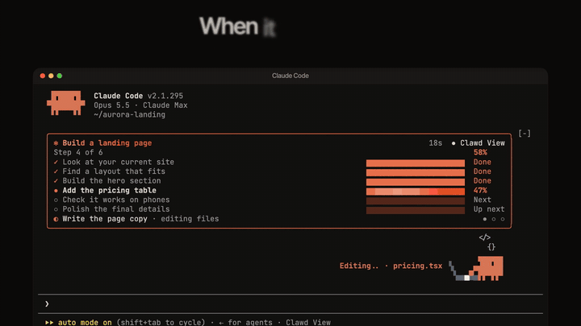
<h3>When it needs you</h3>
A <b>Needs you</b> badge shows when Claude is waiting for your answer or your OK. <a href="#what-the-headline-can-say">All headlines →</a>
</td>
</tr>
<tr>
<td width="50%" valign="top">
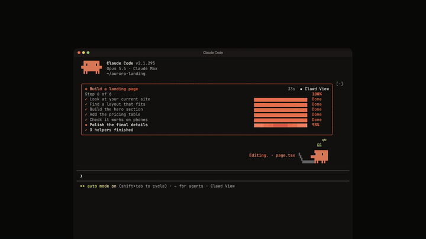
<h3>All done, and celebrated</h3>
How long it took, what changed and who helped, with a little party from Clawd.
</td>
<td width="50%" valign="top">
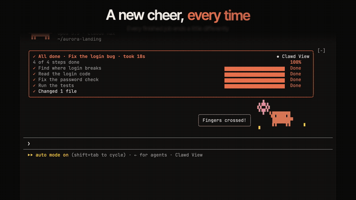
<h3>A new cheer, every time</h3>
Fireworks, confetti, a shout of joy: every finished job ends a little differently.
</td>
</tr>
<tr>
<td width="50%" valign="top">

<h3>Your usage, live</h3>
Limits, context, cost, cache and tokens, shown in full or not at all. <a href="#the-stats">What each one means →</a>
</td>
<td width="50%" valign="top">
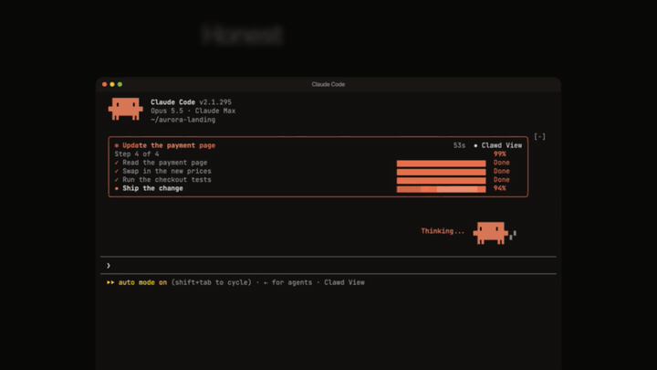
<h3>Honest when it's stuck</h3>
If a step keeps failing, the box says what happened instead of pretending it worked.
</td>
</tr>
<tr>
<td width="50%" valign="top">
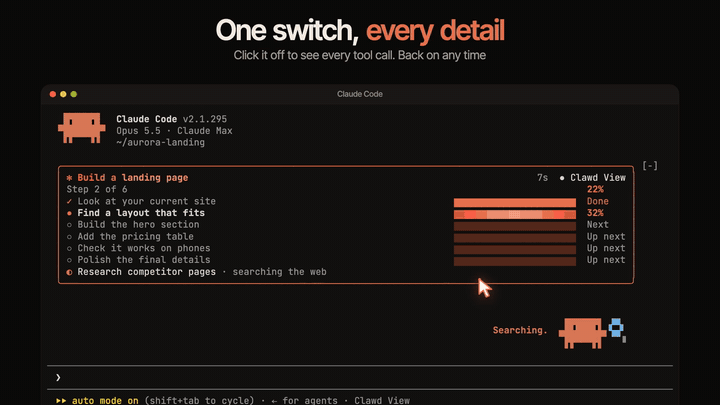
<h3>One switch, every detail</h3>
Click <b>● Clawd View</b> to see every tool call again. Back on any time.
</td>
<td width="50%" valign="top">
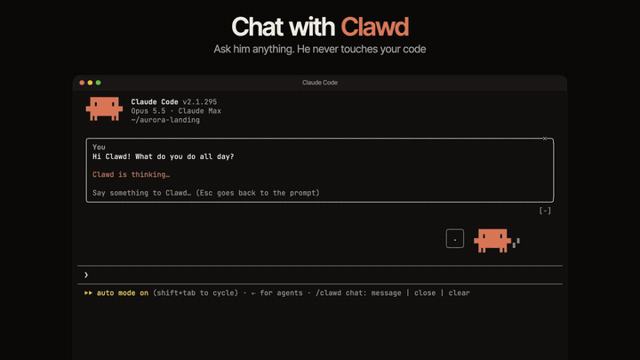
<h3>Chat with Clawd</h3>
Ask him anything with <code>/clawd chat</code>. He never touches your code. <a href="#chat-with-clawd">More →</a>
</td>
</tr>
<tr>
<td width="50%" valign="top">
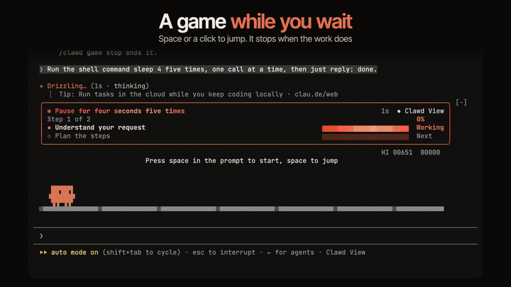
<h3>A game while you wait</h3>
<code>/clawd game</code> turns the space above the prompt into a runner game. <a href="#the-game">How to play →</a>
</td>
<td width="50%" valign="top">
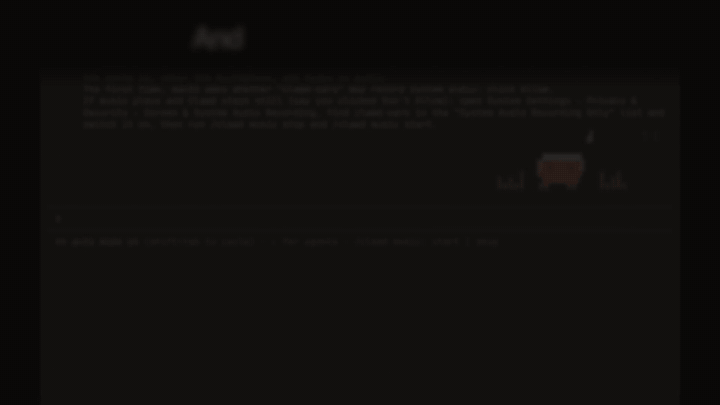
<h3>Music mode</h3>
<code>/clawd music start</code> and Clawd dances to whatever your Mac plays. <a href="#music-mode">Setup →</a>
</td>
</tr>
<tr>
<td width="50%" valign="top">
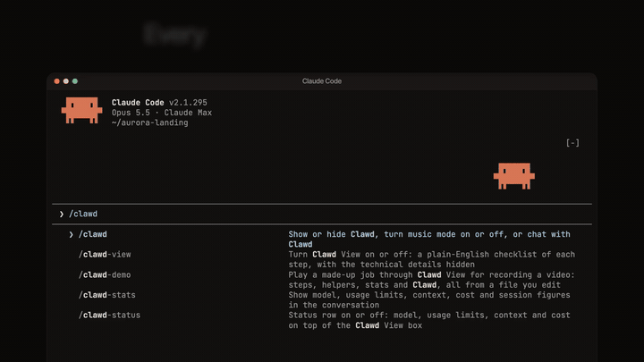
<h3>Every command, one slash away</h3>
Type <code>/clawd</code> to see them all. <a href="#all-commands">Full list →</a>
</td>
<td width="50%" valign="top">
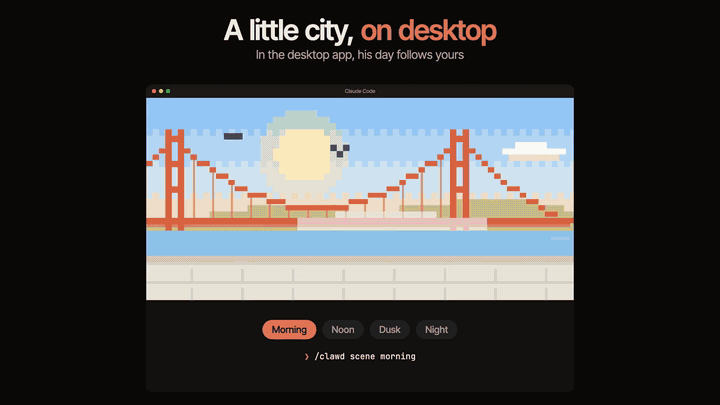
<h3>A little city, on desktop</h3>
In the desktop app his day follows yours, from morning to night. <a href="#in-the-claude-desktop-app">More →</a>
</td>
</tr>
</table>

<br/>

## The checklist box

When you ask Claude for something, a box appears above the prompt:

```
✻ Build the pricing page                                  12s  ● Clawd View
Step 2 of 3                                                         33%
✓ Read the current page                ▆▆▆▆▆▆▆▆▆▆▆▆▆▆▆▆▆▆▆▆  Done
● Add the pricing section              ▆▆▆▆▆▆▆▆▆▆▆▆▆▆▆▆▆▆▆▆  Working
○ Check it looks right                 ▆▆▆▆▆▆▆▆▆▆▆▆▆▆▆▆▆▆▆▆  Next
```

| Part | What it shows |
|---|---|
| **The title** | A short plain-English name for your request. It reads "Your request" until the name arrives (see [Privacy and cost](#privacy-and-cost)) |
| **The timer** | How long Claude has been working. When the job ends, the title says how long it took |
| **Done** ✓ | The step is finished |
| **Working** ● | The step Claude is on. Its bar shows a moving wave, or the percent once Claude reports one |
| **Next** / **Up next** ○ | The step after it, then later steps |
| **The top line** | Which step Claude is on and how far along the whole job is |
| **The news line** | Under the steps: what helpers are doing, warnings, and a summary of the finished job |

### What the headline can say

| Headline | Meaning |
|---|---|
| ✻ *the title* | Claude is working |
| **Needs you**: Claude has a question for you | Claude asked you something; answer it below |
| **Needs you**: Claude needs your OK to continue | A permission prompt is waiting for you. It clears as soon as you answer and the step starts |
| **⚠ Stuck**: a step keeps failing, Claude is trying another way | Several attempts in a row failed |
| **⚠ Stuck**: you said no to a step | You turned down a step. Unfinished steps stay unticked |
| **⚠ Stuck**: Claude couldn't help with that request | Claude declined the request |
| **⚠ Stuck**: *a plain-English reason* | The request hit an error, for example a usage limit or a lost connection |
| **■ Stopped**: you pressed Esc | You interrupted Claude |
| **✓ All done** | Claude finished. The box stays until your next request |

**The ● Clawd View button** at the top right turns Clawd View off (it changes to "○ Clawd View: off", and every tool call shows again). Press it again, or run `/clawd-view on`, to turn it back on.

**Tool calls are hidden** while Clawd View is on. To see them, run `/clawd-view off`, or expand a collapsed group.

> **⚠️ Heads-up**
>
> **If you auto-approve:** with tool calls hidden, in auto-accept or bypass-permissions modes you won't see the commands and edits Claude runs. Permission prompts still show as usual.

**Side panel:** `/clawd-view panel` opens the box as a panel beside the conversation, with every step and the full stats. It works in the terminal's fullscreen mode (`/tui fullscreen`) and in the desktop app. In the terminal's fullscreen mode, a new request opens it on its own when the window is wide enough.

<details>
<summary><b>How the steps get there</b></summary>

<br/>

Clawd View gives Claude two small tools, `plan_steps` (lay out 1 to 8 plain-English steps) and `report_progress` (mark progress on a step), and asks Claude to use them for every request. If Claude uses its own to-do list (TodoWrite or tasks), the box follows that instead. Until Claude has laid out its steps, Clawd View asks it to do so before other tools, at most twice per request, so Claude can never get stuck on it.

Step names are cleaned up for you: file names, paths, code and commands are removed, and names are kept to 40 characters.

Work done in the background or by helper agents doesn't change the steps; the news line under them reports on helpers instead.

</details>

## The stats

At the bottom of the box, when there's room:

| Left column | Right column (this session) |
|---|---|
| **Model**: the model and effort level | **Session**: how long this session has run |
| **5-hour limit**: how much of your 5-hour usage limit is used, and when it resets | **Cache**: how long the prompt cache has left |
| **Weekly limit**: the same for the weekly limit | **Input**: tokens sent this session |
| **Context**: how full the conversation's context window is | **Output**: tokens written this session |
| **Cost**: this session's cost so far | **Messages**: prompts you've sent |

- Before the first reply, some figures say "after first reply" or "starts on reply". Limits whose window has passed say "updates on next reply".
- A limit past 80% turns a deeper orange. The cache turns deeper orange in its last few minutes.
- The stats show **in full or not at all**: when the box has no room for them, they're hidden rather than squeezed.
- `/clawd-stats` prints the full stats into the conversation at any time, labeled with the time. It works even while the stats in the box are switched off.
- `/clawd-status off` hides the stats in the box; `/clawd-status on` brings them back. `/clawd-status` alone switches between the two.

## Clawd

Clawd stands under the checklist and acts out what Claude is doing:

| Claude is… | Clawd… | Caption |
|---|---|---|
| Thinking | bobs up and down, blinks, and thought dots rise | Thinking… |
| Reading a file | holds up a page, eyes scanning it | Reading… · *file name* |
| Writing code (Edit, Write, notebooks) | types on a little laptop, side on, with bits of code bubbling up | Editing… · *file name* |
| Running a command | runs, legs going, with speed lines behind | Running… |
| Searching (Grep, Glob, web search, web fetch) | holds up a magnifying glass | Searching… |
| Finished a request that took 5 seconds or more | throws a party or sets off fireworks for about 4.5 seconds | a cheer like "All done!" |

- Each pose lasts 3 seconds after the tool call, then Clawd goes back to thinking.
- He only celebrates when Claude actually finished: not when you press Esc, or when the request failed.
- While Claude waits for you, he stands still, blinking and glancing around now and then.
- **Click him** (terminal) and he hops, winks and looks around.
- He can't be selected, so he never ends up in text you copy.
- In the terminal he hides when the window is under 26 lines tall.
- `/clawd hidden` hides him; he stays hidden in later sessions until `/clawd show`.

Clawd speaks English or Chinese: see [Settings](#settings). The checklist itself is in English.

## Music mode


`/clawd music start` and Clawd puts on headphones and dances to whatever your Mac is playing, with notes and equalizer bars on both sides. `/clawd music stop` turns it off. While Claude works, he keeps working with his headphones on.

It needs **macOS 14.2 or later** and Apple's command line tools (`xcode-select --install`). On other systems, or without the tools, it says so instead of starting.

Starting the game turns music mode off, and hiding Clawd stops it too.

<br clear="right"/>

<details>
<summary><b>What it installs, and why macOS asks for permission</b></summary>

<br/>

- The first time, Clawd View builds a small helper program, **clawd-ears**, on your Mac from the source in `native/` (with Apple's `swiftc`). It is signed locally, not by a developer account.
- macOS then asks whether **clawd-ears may record system audio**: click Allow. This permission covers everything your Mac plays, including call and meeting audio. clawd-ears never uses the microphone, and it only measures how loud the sound is and when a beat lands. The sound itself is never saved, sent anywhere, or kept in memory.
- So the prompt names clawd-ears rather than your terminal app, the helper starts itself as its own "responsible" process using an undocumented macOS function. If that isn't possible it keeps running under your terminal.
- It runs only while music mode is on, and quits as soon as you turn it off or close Claude Code.
- After an update to Clawd View, the helper may be rebuilt and macOS may ask again.
- If you don't answer the macOS prompt within about 30 seconds, music mode gives up and tells you.

If you didn't get the prompt, open **System Settings → Privacy & Security → Screen & System Audio Recording**, switch on **clawd-ears** under "System Audio Recording Only", then run `/clawd music stop` and `/clawd music start`. To take the permission back, switch it off in the same place.

</details>

## Chat with Clawd


- `/clawd chat` opens a chat pane, ready to type. `/clawd chat hi Clawd!` says something right away.
- The pane opens beside the conversation, or above the prompt in a narrow terminal. Press Esc to go back to the prompt; the pane stays open.
- When Clawd answers, he hops and a speech bubble with his reply shows beside him for a few seconds. The full reply is in the pane.
- Clawd knows what Claude is doing and your conversation so far. He can't run tools or change files; for real work he sends you back to Claude.
- Nothing you say to Clawd reaches Claude's conversation. The chat lasts for the session.
- `/clawd chat close` closes the pane; `/clawd chat clear` clears the chat.
- `/clawd model` shows or changes who answers (`haiku`, `sonnet`, `opus` or `main`), and `/clawd effort` how hard it thinks (`default`, `low`, `medium`, `high`, `xhigh`, `max`). Both are saved to your settings. Changing them reloads Clawd, which stops music mode and the game (the chat is kept).

<br clear="right"/>

What each model choice sends is in [Privacy and cost](#privacy-and-cost).

## The game


`/clawd game` turns the space above the prompt into a runner game, like the browser's offline dinosaur. `/clawd game stop` ends it.

- **Terminal:** with the prompt empty, press space to jump (the space doesn't land in the prompt). A click on the track jumps too; after that click, space, ↑ or W jump, and Esc gives the keyboard back to the prompt.
- **Desktop app:** press **Start**, which turns into **Jump ↵**: press Enter to jump (space in the empty prompt jumps too). **Pause** pauses, **✕** ends the game.
- It speeds up every 100 points, and taller cacti appear as it goes. Your best score is kept across sessions.
- It puts itself away after a minute nobody plays (not while paused).
- Starting it turns music mode off.

<br clear="right"/>

## In the Claude desktop app

<div align="center">

</div>

In the Code tab of the desktop app:

- **The box always shows every step and the full stats**, with this session's figures on the right when the box is wide enough, and underneath when it isn't. The side panel leaves out the limits' reset times so its right column stays straight.
- **Clawd lives in a little pixel city by the bay**, after San Francisco. It follows your local time: morning from 5:00, noon from 10:00, dusk from 16:30, night from 19:30. While Claude has nothing on, Clawd fishes off the waterfront, codes at a café table, waters a planter, or dozes on a bench at night.
  - `/clawd scene next` steps through the times of day; `/clawd scene morning` (or `noon`, `dusk`, `night`) pins one; `/clawd scene auto` follows your local time again; `/clawd scene off` shows plain Clawd without the city, `/clawd scene on` brings it back.
  - `/clawd idle fishing` (or `laptop`, `garden`, `sleep`) pins what he does while he waits; `/clawd idle auto` picks by the time of day again.
- **Clicking Clawd** does nothing in the desktop app (it does in the terminal).
- After installing or updating Clawd View, quit the desktop app fully (Cmd + Q) and open it again.

## Getting the best view in the terminal

> **💡 Tip**
>
> For the full stats on everyday plans, keep the window at least **35 lines tall and 106 wide** (zoom out with Cmd + minus).

<details>
<summary><b>Why window size matters, and what you get at each size</b></summary>

<br/>

Everything at the bottom of the terminal (the box, Clawd, the prompt and the footer) has to fit in your window. If it gets taller than the window, the terminal can't erase the part that scrolled off, and you see broken copies of the box. So the box trims itself in smaller windows: steps always come first, and the stats show only when they fit in full.

| Window size | What you get |
|---|---|
| 40+ lines tall | Full stats for plans up to 9 steps while working, up to 11 when done |
| 35 lines tall | Full stats for plans up to 4 steps while working, up to 6 when done; no stats for longer plans |
| 31 lines tall | Full stats for up to 2 steps when done; otherwise no stats |
| 26 to 30 lines | A few steps at a time, stats mostly hidden (Clawd takes 5 lines) |
| Under 26 lines | Clawd hides; in very short windows the box becomes one line |
| Under 106 wide | No stats (they need 106 columns) |

While you type a `/` command, the box shrinks to one line so the command list has room, and comes back when you're done. Background agents listed at the bottom of the screen are counted in too.

</details>

## All commands

**Clawd View**

| Command | What it does |
|---|---|
| `/clawd-view` | Switches Clawd View on or off |
| `/clawd-view on` / `off` | On, or off to show every step again |
| `/clawd-view panel` | Opens the box as a side panel (terminal fullscreen mode, or the desktop app) |
| `/clawd-view help` | Shows a short guide in the conversation |
| `/clawd-stats` | Prints the full stats, labeled with the time |
| `/clawd-status` | Switches the stats in the box on or off |
| `/clawd-status on` / `off` | Shows or hides the stats in the box |

**Clawd**

| Command | What it does |
|---|---|
| `/clawd` | Shows the list of Clawd commands |
| `/clawd show` | Brings Clawd back |
| `/clawd hidden` (or `hide`) | Hides Clawd, also in later sessions; stops music mode and the game |
| `/clawd music start` / `stop` | Turns music mode on or off |
| `/clawd game` / `game stop` | Starts or ends the game |
| `/clawd chat` | Opens the chat pane, ready to type |
| `/clawd chat <message>` | Says something to Clawd |
| `/clawd chat close` / `clear` | Closes or clears the chat |

<details>
<summary><b>Chat model, effort and desktop scene commands</b></summary>

<br/>

| Command | What it does |
|---|---|
| `/clawd music start` (or `on`) / `stop` (or `off`) | Turns music mode on or off |
| `/clawd game` (or `game start`, `game on`) / `game stop` (or `game off`) | Starts or ends the game |
| `/clawd model` | Shows the chat model |
| `/clawd model haiku` / `sonnet` / `opus` / `main` | Changes the chat model |
| `/clawd effort` | Shows the chat effort |
| `/clawd effort default` / `low` / `medium` / `high` / `xhigh` / `max` | Changes the chat effort |
| `/clawd scene` | Turns the desktop city scene on |
| `/clawd scene next` / `morning` / `noon` / `dusk` / `night` / `auto` / `on` / `off` | Desktop app: the time of day, or the scene on or off |
| `/clawd idle fishing` / `laptop` / `garden` / `sleep` / `auto` | Desktop app: what Clawd does while he waits |

</details>

The commands work while Claude is answering, too. A command Clawd doesn't know shows the list of commands; a value he doesn't know says which values he accepts.

## Settings

In `/config` under Clawd View, or with `/plugin configure clawd-view@clawd-view`:

| Setting | Values | Default |
|---|---|---|
| Language | `auto` (follows your system's language: Chinese for `zh` locales, English otherwise), `en` or `zh`. Applies to Clawd's captions and replies | `auto` |
| Chat model | `haiku`, `sonnet`, `opus`, or `main` (the session's own model) | `haiku` |
| Chat effort | `default` (left to the model), or `low` to `max`. Models without an effort setting ignore it, and `main` uses the session's own | `default` |

## Privacy and cost

> **🔒 Privacy first**
>
> Clawd View talks to nothing but your own Claude account. Everything else (the checklist, the stats, Clawd's animations, music mode) is worked out on your machine.

Here is exactly what it sends to a model, and what else it changes:

| What | When | What's sent |
|---|---|---|
| **The checklist title** | Each request you type | The first 2,000 characters of your request, in one quick Haiku call, to get a short plain-English name |
| **Chatting with Clawd** | Only when you send Clawd a message | With `haiku`, `sonnet` or `opus`: Clawd's last 20 chat lines plus a copy of your conversation with Claude so far, up to the newest 40,000 characters (each message cut at 4,000), with the names of tools and files used but not their contents. With `main`, the chat forks the whole session on the session's own model |
| **Instructions added to every request** | Every request | A short section asking Claude to lay out plain-English steps and report progress with `plan_steps` and `report_progress`. That costs a few extra tokens and tool calls per request. It isn't added to scripted runs (`claude -p`, the SDK), where nothing is shown |
| **What it reads on your machine** | For the stats | This session's own transcript files and the usage figures Claude Code saves in `~/.claude.json` (only the 5-hour and weekly usage). Nothing from them leaves your machine |

## Troubleshooting

| Problem | Fix |
|---|---|
| I see broken copies of the box in the terminal | Make the window taller (see [Getting the best view](#getting-the-best-view-in-the-terminal)) |
| No stats in the box | Make the window at least 106 wide and 35 tall, check `/clawd-status on`, or use `/clawd-stats` |
| No Clawd | Make the window at least 26 lines tall, then `/clawd show` |
| Music mode: Clawd doesn't dance | Play some sound, then check clawd-ears is switched on under System Settings → Privacy & Security → Screen & System Audio Recording, and run `/clawd music stop` and `/clawd music start` |
| Music mode: "needs Apple's command line tools" | Run `xcode-select --install` in your Mac's Terminal |
| The desktop app shows an old version | Quit it fully (Cmd + Q) and open it again |
| I want to see the tool calls | `/clawd-view off` |
| Stats show no history on a very long session on Windows | Long transcripts are read with the system's `tail` command, which Windows doesn't have; the live figures still show |

<details>
<summary><b>What's in this repository</b></summary>

<br/>

| Path | What it is |
|---|---|
| `.claude-plugin/plugin.json` | The plugin's name, version, description and settings |
| `.claude-plugin/marketplace.json` | Makes this repository a marketplace you can install from |
| `hooks/register.tsx` | The entry point: starts the checklist, then Clawd |
| `hooks/clawd-view.tsx` | The checklist box, the stats, and the commands `/clawd-view`, `/clawd-stats`, `/clawd-status` |
| `hooks/clawd.js` | Clawd: poses, celebrations, music mode, chat, game, and the `/clawd` command |
| `hooks/clawd-scene.js` | The desktop app's city scenes |
| `hooks/clawd-game.js` | The game |
| `hooks/clawd-view.js` | Draws Clawd in the terminal and takes clicks on him |
| `native/clawd-ears.swift`, `native/Info.plist` | Music mode's listening helper, built on your Mac the first time |
| `types/index.d.ts` | The values the plugin keeps for a session |
| `tests/` | Tests for `claude plugin test` |
| `docs/media/` | The animations in this guide |

**Development:** `claude plugin validate .` checks the plugin, `claude plugin test .` runs the tests, and `claude --plugin-dir .` loads your copy in a session.

</details>

## Credits and licence

Clawd's animations, music mode, chat and game are based on [Clawd Buddy](https://github.com/zhanbodev/clawd-buddy) by zhanbodev.

Clawd View's own code is released under the [MIT licence](LICENSE). See the licence file for the note on Clawd's artwork.

<div align="center">

<br/>


<sub>Clawd is the mascot of Anthropic's Claude Code. Clawd View is an unofficial, fan-made mod, not a product of Anthropic.</sub>

<br/><br/>

<a href="#clawd-view"></a>

</div>
